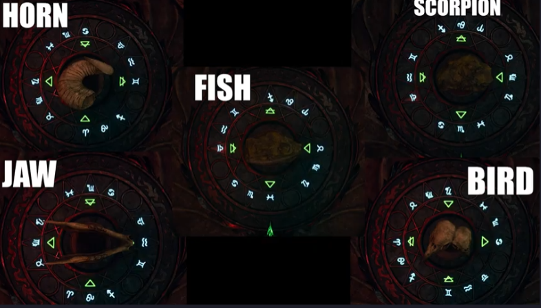

# Black Ops 6: Crafting the Elemental Swords in Citadelle des Morts

In the "Citadelle des Morts" map of Black Ops 6 Zombies, players can craft four unique elemental swords, each with distinct abilities. These swords are:

- **Caliburn: Dragon's Fire**
- **Durendal: Stag of the Storms**
- **Balmung: Raven's Shadow**
- **Solais: Lion of Light**

Below is a comprehensive guide to obtaining each sword, along with the incantations that you need for the easter egg.

---

## Prerequisite

1. Open the Pack-A-Punch
2. Open the door to talk to Kraftt

3. Collect the 4 pages in the sitting room [staminup room] (they all have red glowing symbols on them)
4. Get to round 10 and get the stamp from the knight zombie
5. Go to the knight of the sword you want in the sword room

---

## Caliburn: Dragon's Fire

Caliburn harnesses the power of fire, delivering devastating incendiary attacks.

### Step 1: Activate Caliburn

1. **Approach the Knight Statue**: Locate the Knight statue representing Caliburn in the Dining Room.
2. **Use the Stamp**: Interact with the statue using the corresponding stamp to activate the sword.

### Step 2: Get the Sword

1. **Spawn**: Go to left side of spawn and notice fire bowl, hold F.
2. **RUN!!!**: Run as fast as possible back to the knight.
3. **Right side of spawn**: Do the same on the right side of spawn.
4. **Near the cannon**: Do the same near the cannon.
5. **Get the sword**

### Step 3: Complete the Incantation

1. **Light the fires**: Use a molotov or the fire ability to light the three fires, kill the zombies.
2. **Kill the fast guy that spawns.**
3. **Ankh**: Put the ankh in the courtyard below where the devil circle spawns.

---

## Durendal: Stag of the Storms

Durendal channels the power of storms, unleashing electrical attacks.

### Step 1: Obtain the Ritual Item - Lightning Rods

1. **Collect the Rods**: Locate three Lightning Rods scattered across the map.

- Lightning rod in basement on zombie, kill it
- Next to deadshot daquiri, it's resting near the perk
- Use deadwire to shoot the electrical box in the village near Speed Cola. It's on an incline ramp.  

2. **Place the Rods**: Insert the rods into the metal pot on the Hillside Rampart. It's above the courtyard on the castle wall.

### Step 2: Charge the Rods

1. **Kill Purple-Eyed Zombies**: Eliminate zombies with glowing purple eyes with the sword. After killing 6-7 purple eyes the sword is charged, then strike the vase with the sword. Repeat this three times or until the three rods are charged.  

2. **Activate the Sword**: Place Durendal into the pot after the rods are fully charged to activate the sword.

### Step 3: Complete the Incantation

1. **Collect the Horshoe**: Obtain the horshoe in the barn next to deadshot daquiri. It's hanging above the doorway in the center. Shoot it.
2. **Fire out of the cannon**: Fire yourself out of the cannon and a storm should form. Pick up the horshoe that is charged.
3. **Confirm Completion**: Come back to the spawn area and hold F on the yellow circle that spawns.
4. **Kill zombies**: Kill zombies to fill the soulbox and collect the incantations from the gold chest.

---

## Balmung: Raven's Shadow

Balmung utilizes the power of darkness, delivering shadow-infused strikes.

### Step 1: Obtain the Ritual Item 

There are five possible ritual items. No gif for this but they are all in the purple armor room with a weapon upgrade station in the castle:  

- The horn. Head height shelf right of the table.
- Jaw bone. Opposite side of the same room.
- Fish fossil. Near the armor in the same room near a candle on the table its at.
- Scorpion fossil. On the table in the middle of the room.
- Bird heads. On the book shelf in the same room.

### Step 3: Activate Balmung

1. **Basement vault thing**: Underneath the bar there will be a vault thing, hold F to place your item. Hold F again to place the sword. Hold F again to start moving the combination lock.

2. **Enter the combo**:

### Step 4: Get the Sword

**Purple Portal**: Purple balls will spawn around the portal that appeared. The balls follow you. Drag the balls into the hole.

**The bar**: The next portal location is at the bar. Drag the balls into the hole.

**The pool table**: The next portal location is at the pool table in the bar. Drag the balls into the whole.

**Get the sword**: Go back to the basement, deposit the balls in the whole and pick up the sword.

### Step 5: Complete the Incantation

1. **Slide in the Oubliette Room**: Use the slide in the Oubliette room next to packapunch to enter a new area.
2. **Shoot the Raven Statue**: During the slide, shoot the raven statue to trigger its movement.
3. **Follow and Shoot**: Track the raven as it moves across the map, shooting it each time it stops.
4. **Collect the Talon**: Once the raven stops moving, collect the Raven’s Talon.
5. **Soul Box**: Go to the water room and place the talon on the yellow symbol. Kill zombies. Melee the gold chest.
6. **Take the Incantation**

---

## Solais: Lion of Light

Solais channels the power of light, offering radiant and piercing attacks.

### Step 1: Obtain the Ritual Item - Paladin’s Brooch

1. **Shoot the Red Crystal**: Locate the red crystal above the Vulture Aid machine in the Dining Hall and shoot it.
2. **Follow the Red Beams**: Track the beams of light across the map.

3. **Collect the Brooch**: Retrieve the Paladin’s Brooch at the final location.
4. **Get kills**: Run to the lion grafitti and put the brooch in the yellow portal then kill zombies until the yellow thing disappears.

### Step 2: Solve the Lion’s Head Puzzle

1. **Kill Glowing Parasite**: Eliminate a glowing Parasite near the lion’s head door in the Village Ascent.
2. **Strike the Door**: Hit the lion’s head door four times to open it.
3. **Complete the Puzzle**: Solve the icon-matching puzzle inside to activate Solais.

### Step 3: The Puzzle
1. Place the sword in the statue in the room.
2. A symbol will spawn on the front, shoot the corresponding symbol in the ceiling.
3. Repeat 3 more times.
4. Grab the sword

### Step 4: Cover yourself in oil
1. Go back to the glowing chest
2. Take the light incantation